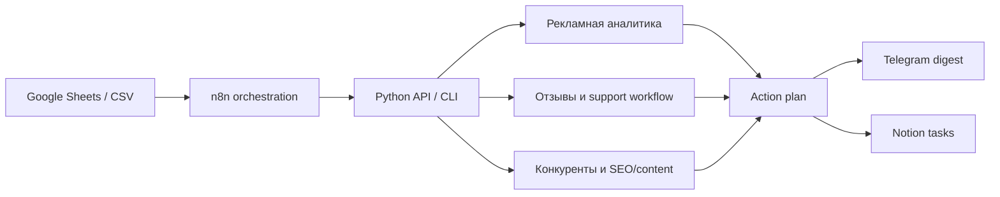
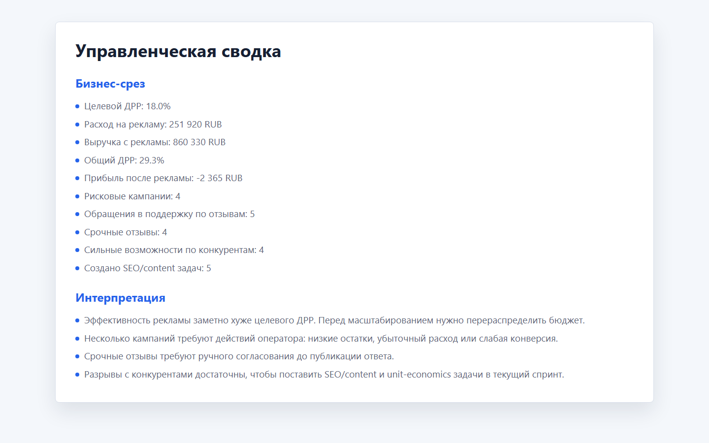
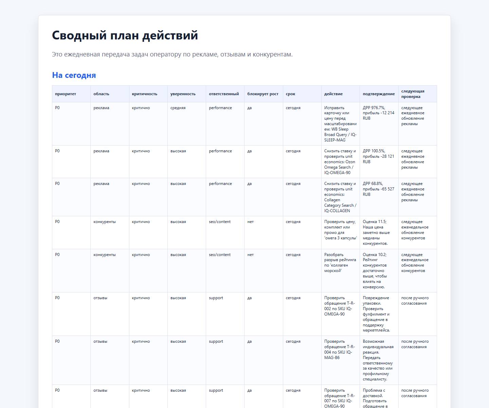
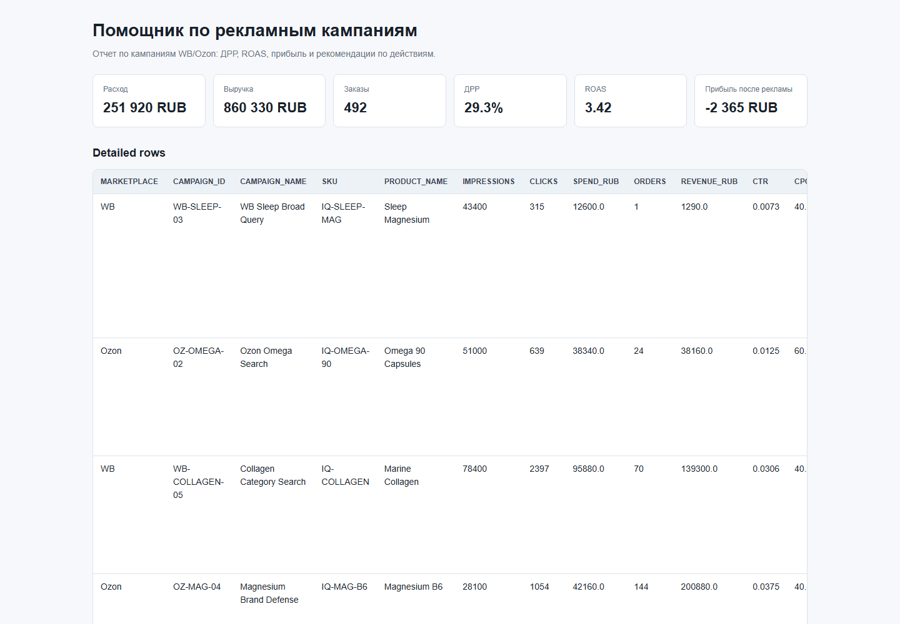
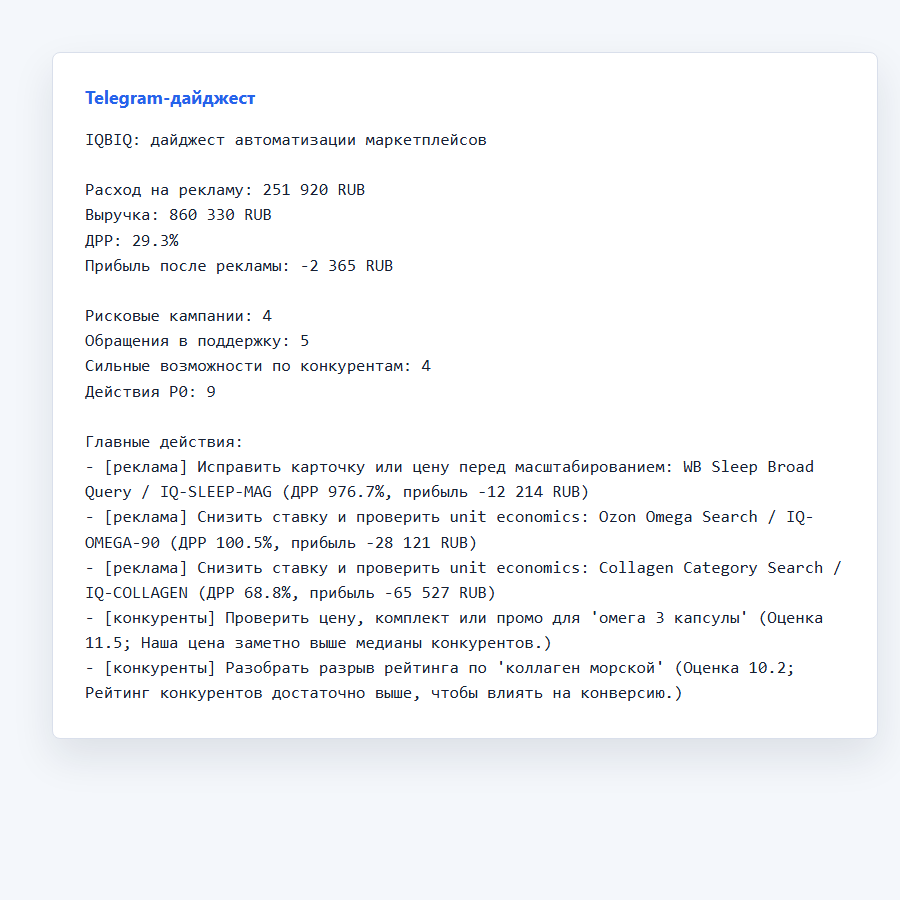

# IQBIQ: портфолио автоматизации маркетплейсов

Портфолио-проект под вакансию автоматизации e-commerce процессов: рекламная аналитика WB/Ozon, работа с отзывами, конкурентный SEO/content мониторинг, Google Sheets, n8n, Telegram, Notion и API-интеграции.

Статус: готов к показу как portfolio case и технический prototype. Это не production rollout на реальных кабинетах WB/Ozon: данные синтетические, а реальные marketplace API вынесены в adapter boundaries.

## Коротко

Проект показывает полный контур работы:



Главная идея: n8n, Telegram, Notion и Google Sheets используются как delivery/orchestration слой, а проверяемая бизнес-логика остается в Python и покрыта тестами.

## Почему это подходит под вакансию IQBIQ

| Требование вакансии | Что реализовано в проекте |
|---|---|
| Автоматизация отчетности по рекламе WB/Ozon | Расчет CTR, CPC, CR, ДРР, ROAS, прибыли после рекламы, risk level и next step |
| Анализ ставок, конверсий, заказов и ДРР | `ads_reporter.py`, `ads_decision_audit.csv`, HTML dashboard, unit economics |
| AI/no-code/low-code автоматизация | n8n workflows + Python API boundary + payload builders для Telegram/Notion |
| Make/n8n/Google Sheets/API | Локальный n8n self-host, Google Sheets no-cloud demo, FastAPI endpoints |
| Автоматизация отзывов | Review agent: классификация, safe reply drafts, support tickets, manual approval |
| Конкуренты, SEO и контент | Competitor monitor: price/rating/review gaps, ad pressure, SEO/content tasks |
| Таблицы, финансы, поставки, задачи | Unit economics, data quality checks, action plan, Notion task upsert |
| Инструкции и регламенты | SOP оператора, demo checklist, GitHub publication guide, risk register |

## Что сделано

| Блок | Результат |
|---|---|
| Реклама | Кампании получают рекомендации: снизить ставку, поставить на паузу, исправить карточку, ограничить расход, масштабировать |
| Unit economics | Учитываются себестоимость, комиссия, логистика, хранение, возвраты, налог, break-even ДРР |
| Отзывы | Отзывы классифицируются по теме/срочности, создаются обращения в поддержку и safe drafts |
| Compliance для БАДов | Ответы не публикуются автоматически, risky health cases уходят на manual approval |
| Конкуренты | Считаются price index, rating gap, review gap, рекламное давление и opportunity score |
| Общий план действий | `action_plan.md` объединяет рекламу, отзывы и конкурентов в один список задач |
| Интеграции | Google Sheets no-cloud, n8n, Telegram live-send, Notion task upsert без дублей |
| Качество | 35 unit tests, regression snapshots, scenario coverage, preflight, secret scan |

## Как выглядит работа

### Управленческая сводка

Сводка отвечает на вопрос руководителя: что происходит с рекламой, отзывами и конкурентами сегодня.



### Сводный план действий

Главный артефакт проекта: не просто отчет, а приоритетный список действий для performance, support и SEO/content.



### Рекламный dashboard

HTML dashboard показывает рекламные метрики, риск, прибыль после рекламы и рекомендации по кампаниям.



### Telegram digest

Короткий дайджест для команды: основные метрики и P0-действия.



## Демо-артефакты

После запуска генерируются:

| Файл | Зачем смотреть |
|---|---|
| `reports/executive_summary.md` | управленческая сводка |
| `reports/action_plan.md` | ежедневный план действий |
| `reports/telegram_digest.txt` | текст для Telegram |
| `reports/ads_dashboard.html` | визуальный отчет по рекламе |
| `reports/ads_decision_audit.csv` | audit trail рекламных решений |
| `reports/data_quality_report.md` | проверка качества входных данных |
| `reports/review_replies.csv` | approval workflow для отзывов |
| `reports/support_tickets.csv` | обращения в поддержку |
| `reports/seo_content_tasks.csv` | SEO/content backlog по конкурентам |

## Быстрый запуск

PowerShell из корня проекта:

```powershell
cd "C:\Users\WORK\Documents\Work Projects\iqbiq-marketplace-automation-portfolio"
$env:PYTHONPATH = ".\src"
python -m marketplace_automation.cli run-all --data-dir .\data\sample --out-dir .\reports
python -m unittest discover -s tests
```

Открыть:

```text
reports/executive_summary.md
reports/action_plan.md
reports/telegram_digest.txt
reports/ads_dashboard.html
```

## Live-демо

Live-контур уже подготовлен:

```text
публичная Google Sheet
  -> локальный n8n self-host
  -> локальный Python API
  -> Telegram digest
  -> Notion task upsert
```

Команда при наличии локальных токенов:

```powershell
$env:TELEGRAM_BOT_TOKEN = "..."
$env:TELEGRAM_CHAT_ID = "..."
$env:NOTION_TOKEN = "..."
$env:NOTION_DATABASE_ID = "..."
.\scripts\live_demo.ps1
```

Ожидаемый результат:

```text
Workflow выполнен:         True
Telegram отправлен:        True
Notion обновил без дублей: True
```

Подробная инструкция: [docs/n8n_self_host_setup.md](docs/n8n_self_host_setup.md).

## Архитектура репозитория

```text
data/sample/                  синтетические демо-данные
data/google_demo/             данные, выгруженные из демо Google Sheet
data/scenarios/               normal/risky/edge сценарии
docs/                         архитектура, риски, инструкции, чеклисты
integrations/n8n/             workflow для n8n
projects/                     три отдельных прикладных кейса
scripts/                      preflight, live demo, screenshots
src/marketplace_automation/   Python-логика, adapters, CLI, API
tests/                        unit и regression tests
reports/                      generated outputs, не коммитятся
```

## Ключевые модули

| Модуль | Назначение |
|---|---|
| `ads_reporter.py` | рекламные метрики, решения по кампаниям, HTML/Markdown отчеты |
| `unit_economics.py` | экономика SKU и break-even ДРР |
| `review_agent.py` | классификация отзывов, drafts, support tickets, compliance flags |
| `competitor_monitor.py` | конкурентные gaps и SEO/content tasks |
| `portfolio.py` | объединение трех кейсов в action plan и executive summary |
| `api.py` | FastAPI boundary для n8n/Make/HTTP сценариев |
| `notifications.py` | Telegram digest formatter |
| `notion_payloads.py` | payload builder для Notion tasks |
| `adapters/` | CSV, Google Sheets, no-cloud Sheets, WB/Ozon API boundaries |

## Интеграции

n8n templates:

- `integrations/n8n/no_cloud_marketplace_digest.json`
- `integrations/n8n/ads_report_to_telegram.json`
- `integrations/n8n/review_agent_to_support.json`
- `integrations/n8n/competitor_monitor_to_notion.json`

Что они показывают:

- ручной или scheduled запуск;
- чтение Google Sheets через публичные CSV-ссылки;
- HTTP Request к локальному Python API;
- отправку Telegram digest;
- создание или обновление Notion tasks по `Task ID`;
- отсутствие Google Cloud зависимости в demo mode.

## Проверки

Unit tests:

```powershell
$env:PYTHONPATH = ".\src"
python -m unittest discover -s tests
```

Полная проверка перед публикацией:

```powershell
.\scripts\preflight.ps1
```

Последний проверенный результат:

```text
35 tests OK
Финальная проверка пройдена.
```

## Что говорить на собеседовании

```text
Я собрал воспроизводимый контур автоматизации маркетплейсов:
реклама, отзывы, конкурентный SEO, Google Sheets, n8n, Telegram и Notion.

Python отвечает за проверяемую бизнес-логику: ДРР, ROAS, unit economics,
review compliance, competitor scoring и приоритизацию действий.

n8n используется как оркестратор: читает таблицы, вызывает API и доставляет
результат в Telegram и Notion. Главный output — action plan, который превращает
сырые таблицы в задачи для performance, support и SEO/content.
```

## Ограничения

- Данные синтетические, чтобы не публиковать коммерческую информацию.
- Реальные WB/Ozon API показаны как adapter boundary; для production нужны токены seller cabinet.
- Telegram/Notion live-demo требует локальных токенов, которые нельзя коммитить.
- Ответы на отзывы не auto-publish: для БАДов нужен manual approval.
- Production rollout потребует retries, rate limits, auth, monitoring и калибровки thresholds на реальных данных.

## Документы

- [docs/case_study.md](docs/case_study.md)
- [docs/architecture.md](docs/architecture.md)
- [docs/vacancy_fit_matrix.md](docs/vacancy_fit_matrix.md)
- [docs/n8n_self_host_setup.md](docs/n8n_self_host_setup.md)
- [docs/google_sheets_no_cloud_setup.md](docs/google_sheets_no_cloud_setup.md)
- [docs/risk_register.md](docs/risk_register.md)
- [docs/submission_checklist.md](docs/submission_checklist.md)
- [docs/final_application_message.md](docs/final_application_message.md)
